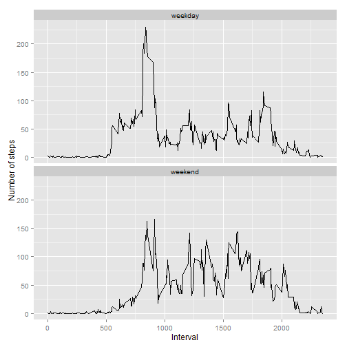

```r
library(ggplot2)
library(dplyr)
```

## Loading and preprocessing the data

```r
#Read activity data stored in the data directory
setwd("~/ReproducibleResearch/Peer_Assesment1/RepData_PeerAssessment1")
data <- read.csv(file =  "data/activity.csv")
```


## What is mean total number of steps taken per day?

## Make a histogram of the total number of steps taken each day.

```r
#Aggregate steps to date
data_per_day <- na.omit(data) %>% 
  group_by(date) %>%
  summarise(total_steps = sum(steps, na.rm=TRUE))

#Make histogram
ggplot(data_per_day) + 
  geom_histogram(aes(x = total_steps)) +
  xlab("Total Steps") +
  ggtitle("Total number of steps taken each day")
```

```
## stat_bin: binwidth defaulted to range/30. Use 'binwidth = x' to adjust this.
```

 

## Calculate and report the mean and median total number of steps taken per day.


```r
#Calculate mean and median steps per day
mm <- data_per_day %>%
  summarise(mean_steps = mean(total_steps, na.rm=T),
            median_steps = median(total_steps, na.rm=T))
mm
```

```
## Source: local data frame [1 x 2]
## 
##   mean_steps median_steps
## 1   10766.19        10765
```

The mean the total number of steps taken per day is 1.0766189 &times; 10<sup>4</sup> steps, while the median is 10765 steps.

## What is the average daily activity pattern?


## Make a time series plot (i.e. type = "l") of the 5-minute interval (x-axis) and the average number of steps taken, averaged across all days (y-axis)

```r
#Average across all days
data_per_interval <- data %>% 
  group_by(interval) %>%
  summarise(average_steps = mean(steps, na.rm = TRUE))

#Plot Times Series
with(data_per_interval, 
     plot(interval, average_steps, type = "l"))
```

 

## Which 5-minute interval, on average across all the days in the dataset, contains the maximum number of steps?


```r
#Find the peak interval
peak_index <- which.max(data_per_interval$average_steps)
peak_interval <- data_per_interval$interval[peak_index]
peak_interval
```

```
## [1] 835
```
Interval number 835 has the maximum number of steps.


## Imputing missing values


##Calculate and report the total number of missing values in the dataset (i.e. the total number of rows with NAs)

```r
missing_row_count <- nrow(data)-nrow(na.omit(data))
```
There are 2304 rows with missing values.

##Devise a strategy for filling in all of the missing values in the dataset. The strategy does not need to be sophisticated. For example, you could use the mean/median for that day, or the mean for that 5-minute interval, etc.


```r
#impute missing values by average value at interval

#Create a dictionary for value lookups
impute_value <- data_per_interval$average_steps
names(impute_value) <- data_per_interval$interval

imputeSteps <- function(step, interval, dictionary) {
  #function to impute values from a dictionary
  #note: only works on atomic types 
  if (is.na(step)) {
    return_value <- dictionary[as.character(interval)]
  } else {
    return_value <- step
  }
  as.numeric(return_value)
}
```

##Create a new dataset that is equal to the original dataset but with the missing data filled in.

```r
data_imputed <- data %>% group_by(date, interval) %>%
  mutate(steps = imputeSteps(steps, interval, impute_value))
```

##Make a histogram of the total number of steps taken each day and Calculate and report the mean and median total number of steps taken per day. Do these values differ from the estimates from the first part of the assignment? What is the impact of imputing missing data on the estimates of the total daily number of steps?

```r
#Aggregate steps to date
data_per_day <- data_imputed %>% 
  group_by(date) %>%
  summarise(total_steps = sum(steps, na.rm=TRUE))

#Make histogram
ggplot(data_per_day) + 
  geom_histogram(aes(x = total_steps)) +
  xlab("Total Steps") +
  ggtitle("Total number of steps taken each day")
```

```
## stat_bin: binwidth defaulted to range/30. Use 'binwidth = x' to adjust this.
```

 


```r
#Calculate mean and median steps per day
mm2 <- data_per_day %>%
  summarise(mean_steps = mean(total_steps, na.rm=T),
            median_steps = median(total_steps, na.rm=T))
mm2
```

```
## Source: local data frame [1 x 2]
## 
##   mean_steps median_steps
## 1   10766.19     10766.19
```

The mean the total number of steps taken per day is now 1.0766189 &times; 10<sup>4</sup> steps, while the median is 1.0766189 &times; 10<sup>4</sup> steps. These respectively differ by 0 steps and -1.1886792 steps.

We centered the distribution of steps when imputed for missing values based on the average step count at a given interval.

## Are there differences in activity patterns between weekdays and weekends?


##Create a new factor variable in the dataset with two levels -- "weekday" and "weekend" indicating whether a given date is a weekday or weekend day.

```r
data_with_week <- data_imputed %>% 
  mutate(weekend = ifelse(weekdays(as.Date(date)) %in% c("Saturday", "Sunday"),
         "weekend", 
         "weekday")
    )
```
##Make a panel plot containing a time series plot (i.e. type = "l") of the 5-minute interval (x-axis) and the average number of steps taken, averaged across all weekday days or weekend days (y-axis). The plot should look something like the following, which was created using simulated data:

```r
data_week_avg <- data_with_week %>%
  group_by(interval, weekend) %>%
  summarise(avg_steps = mean(steps, na.rm=T))
ggplot(data_week_avg, aes(x =interval, y = avg_steps)) + 
  geom_line() + 
  facet_wrap(~weekend, ncol = 1) +
  ylab("Number of steps") +
  xlab("Interval")
```

 
